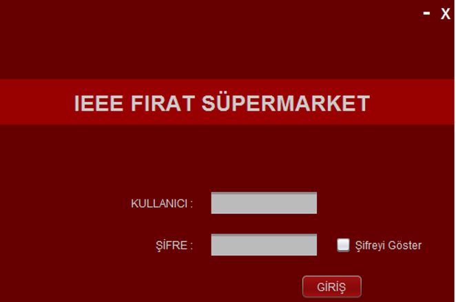
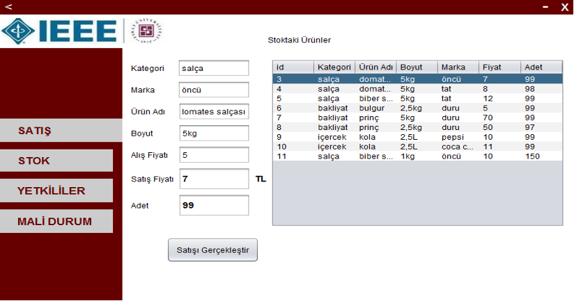
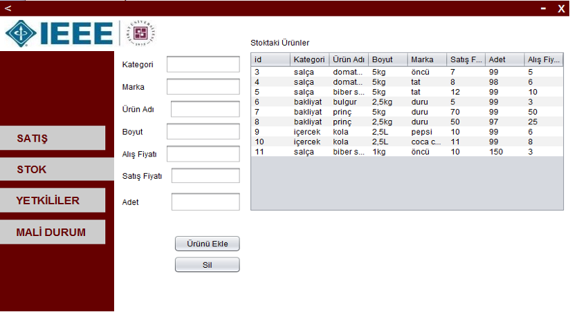
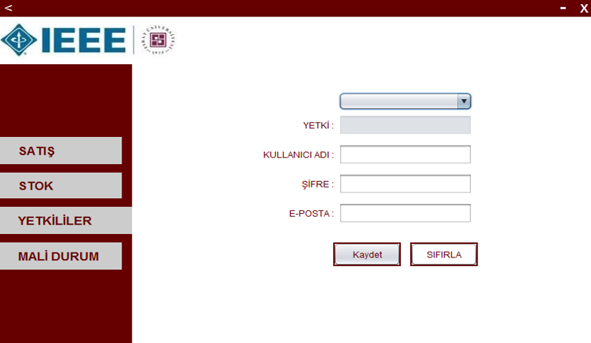
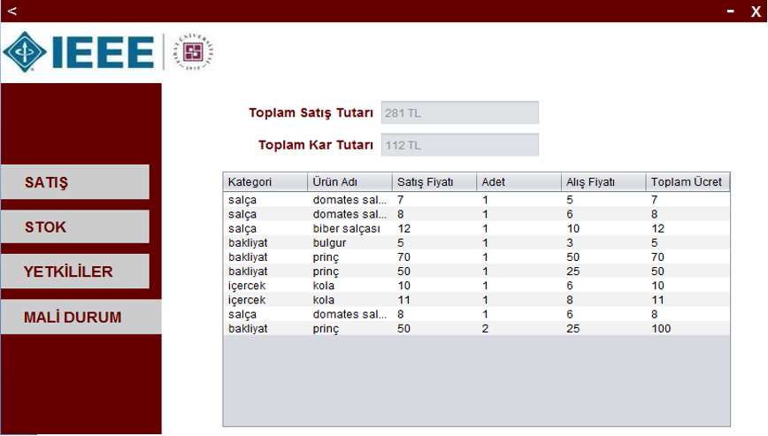

# MarketStockModule

This project was made by using Java and MySql technologies. In the project, it is aimed to follow the stock and sell the products in a market. The program consists of three different interfaces. While the program is opening, the following interfaces work according to the user's authority.

+ Manager;
    + Sales transaction
    + Adding and deleting items in stock
    + Adding a new authority
    + Financial status

+ Sales Consultant;
    + Sales transaction
(Insufficient authorization warning is received if other actions are attempted.)

+ Warehouse worker;
    + Adding and deleting items in stock
(Insufficient authorization warning is received if other actions are attempted.)

## Application Screens
### Login Screen

### Sales Screen

### Add-Remove Screen

### Authorization Screen

### Accounting Screen

Developed by the Computer Society Desktop Programming Team.